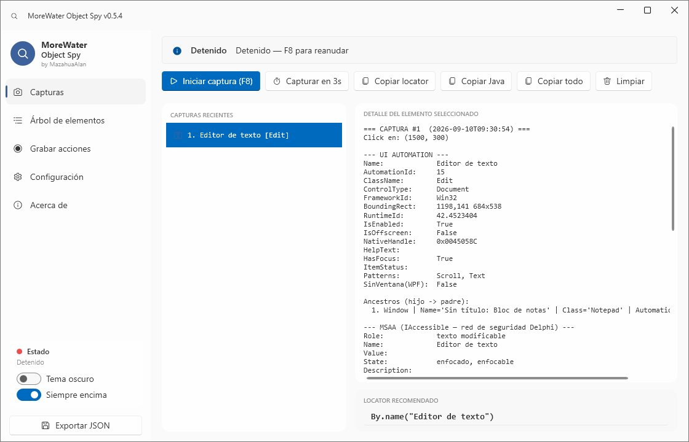
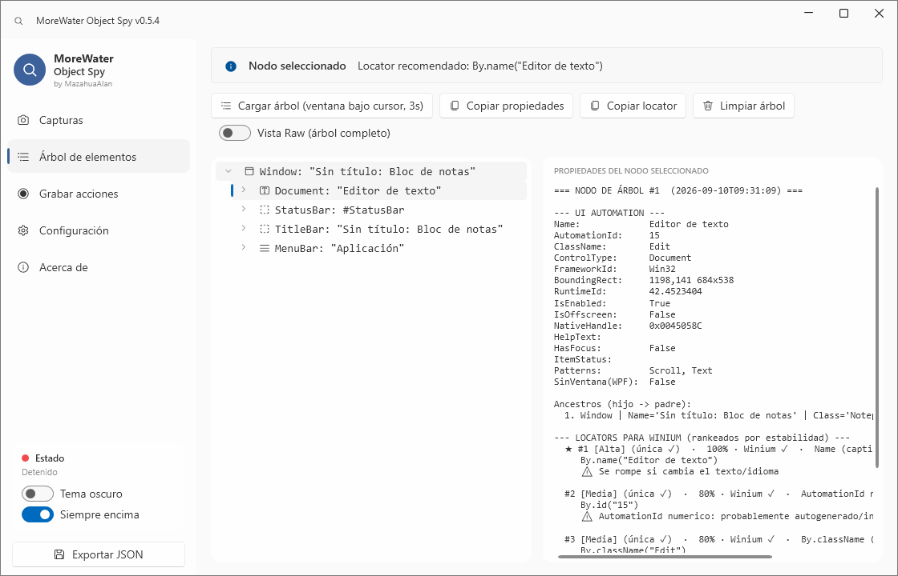
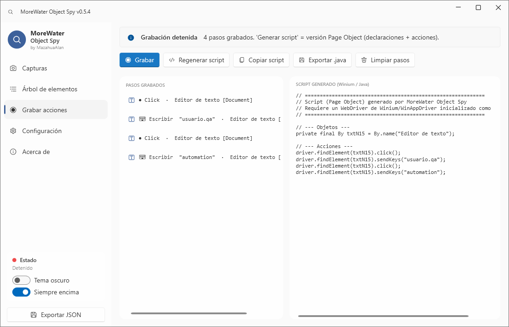

<h1 align="center">MoreWater Object Spy</h1>

<p align="center">
  <strong>Inspector de objetos de UI y grabador de acciones para QA Automation.</strong><br>
  Captura el objeto en el <em>instante del clic</em> —aunque la ventana cambie o se abra un modal—<br>
  y genera <strong>locators listos para Winium/WinAppDriver</strong>, rankeados por estabilidad, unicidad
  y <strong>compatibilidad real con Winium</strong>.
</p>

<p align="center">
  
  
  
  
  
  
</p>

<p align="center">
  
</p>

<p align="center">
  <em>Un clic sobre cualquier control y ya tienes sus propiedades, sus locators rankeados y el recomendado.</em><br>
  <a href="docs/GUIA_VISUAL.md"><strong>→ Guía visual completa</strong></a>
</p>

---

## ¿Por qué existe?

Inspect.exe, UISpy o Accessibility Insights **pierden el objeto** cuando la aplicación cambia de ventana, abre un modal
o roba el foco — justo lo más común en apps de escritorio reales. Y cuando sí lo encuentran, **solo muestran propiedades**:
el locator hay que armarlo, verificarlo y depurarlo a mano.

**MoreWater Object Spy** toma un *snapshot inmutable* del objeto en el instante del clic (sobrevive aunque la ventana
desaparezca) y te entrega el **locator recomendado**, verificando además que sea **único** y que **Winium lo soporte**.

## Características

| | |
|---|---|
| 🎯 **Captura global** | F8 (al clic) o F9 / "Capturar en 3s" (bajo cursor, para menús que se cierran). |
| 🧩 **3 motores** | UI Automation + MSAA + Win32 — red de seguridad para controles Delphi/VCL. |
| 🏷️ **Locators rankeados** | `By.id` / `By.name` / `By.className` / `By.xpath`, ordenados por estabilidad, con **% de confianza**. |
| ✅ **Compatible con Winium** | Marca qué locators soporta Winium de verdad; MSAA y Win32 quedan como diagnóstico. |
| 🔢 **Unicidad + índice** | Cuenta coincidencias y, si hay varias, da el **índice correcto** (XPath `[n]` y `findElements().get(i)`). |
| ⬆️ **Promoción inteligente** | Si clicas el texto dentro de un botón, sube solo al control accionable. |
| ⏺️ **Grabador de acciones** | Graba clics y escritura, y produce un **script Winium/Java estilo Page Object**. |
| 🌳 **Árbol de objetos** | Carga perezosa, **Vista Raw** (árbol completo) e iconos por tipo de control. |
| 📋 **Copiar sin fricción** | Locator, snippet Java, propiedades completas y script — desde Capturas y desde el Árbol. |
| 🔴 **Resaltado en pantalla** | Dibuja el elemento seleccionado, como Inspect.exe. |
| 🎨 **UI Fluent** | Tema claro (Windows 11) / oscuro (paleta Docks) y modo "siempre encima". |
| 💾 **Exportación JSON** | Historial completo de capturas reutilizable. |

## Motores de inspección

| Motor | Expone | Cubre |
|---|---|---|
| **UI Automation** | Name, AutomationId, ControlType, FrameworkId, patterns, HelpText, foco, ancestros, árbol | WPF, WinForms, UWP/XAML, Win32 |
| **MSAA** | Role, State, Name, Value, DefaultAction | Delphi/VCL y apps legacy |
| **Win32** | HWND, ClassName, título, PID | Cualquier ventana nativa |

> Winium localiza por UI Automation. MSAA y Win32 están para **entender** el control cuando UIA se queda corto
> (típico en Delphi/VCL), no para construir el locator.

## Vistas

- **Capturas** — historial de objetos capturados, propiedades de los 3 motores y locator recomendado.
- **Árbol de elementos** — explora la ventana completa como jerarquía; selecciona un nodo para ver sus propiedades
  y **copiarlas** (o copiar su locator) sin pasar por la captura al clic.
- **Grabar acciones** — pasos ordenados (clic / escribir / tecla) y **script en vivo**; doble clic en un paso para
  elegir otro locator entre los candidatos y regenerar.
- **Configuración** y **Acerca de**.

La vista **Árbol** explorando el Bloc de notas: jerarquía a la izquierda, propiedades y locators rankeados a la derecha.



## Grabador de acciones

Pulsa **Grabar** y opera la app objetivo: cada clic se vuelve un paso y lo que escribes se agrupa por campo.
El script se genera **mientras grabas**, en formato Page Object:



```java
// Declaraciones
private static final By BTN_ACEPTAR = By.id("btnAceptar");
private static final By TXT_USUARIO = By.name("Usuario");

// Acciones
driver.findElement(TXT_USUARIO).sendKeys("mazahua");
driver.findElement(BTN_ACEPTAR).click();
```

Si un locator no es único, el script usa el índice determinístico:

```java
driver.findElements(BTN_GUARDAR).get(2).click();  // objeto #3 de 5
```

Puedes **copiar** el script o **exportarlo** a `.java`.

## Apariencia

Tema claro (Fluent, Windows 11) y tema oscuro con la paleta Docks:


## Requisitos

- .NET SDK **8.0**
- Windows 10 / 11 / Server 2019+

## Uso

```powershell
dotnet run --project MoreWaterObjectSpy
```

1. **F8** inicia la captura global.
2. Haz clic en cualquier control de la app objetivo.
3. Revisa propiedades (UIA / MSAA / Win32) y copia el **locator recomendado**.
4. Explora la vista **Árbol de elementos**, **graba** un flujo o exporta el historial a **JSON**.

> Si la app objetivo corre como administrador, ejecuta también la spy como administrador.

### Publicar un ejecutable autónomo

```powershell
dotnet publish MoreWaterObjectSpy\MoreWaterObjectSpy.csproj -c Release -r win-x64 --self-contained true `
  -p:PublishSingleFile=true -p:EnableCompressionInSingleFile=true `
  -p:IncludeNativeLibrariesForSelfExtract=true -p:DebugType=none
```

Salida: `bin\Release\net8.0-windows\win-x64\publish\MoreWaterObjectSpy.exe` (~70 MB, no requiere .NET instalado).

## Documentación

- 🖼️ **[`docs/GUIA_VISUAL.md`](docs/GUIA_VISUAL.md)** — guía gráfica: qué hace cada parte de cada vista, con capturas anotadas.
- 🌐 **[Sitio de documentación](https://mazahuaalan.github.io/MoreWaterObjectSpy-docs/)**
- [`docs/DOCUMENTACION_TECNICA.md`](docs/DOCUMENTACION_TECNICA.md) — arquitectura, flujo de captura y lógica de locators.

## Hoja de ruta

- **Búsqueda/filtro en el árbol** y "Copiar como Page Object" contra un framework existente.
- **Multi-framework** → exportar a WinAppDriver, FlaUI y Appium.
- **Extensión a Web** → adaptador DOM (Selenium / Playwright) reutilizando la lógica de ranking, unicidad e índice.
- Validación de locator en vivo, screenshots por captura, CI.

## Licencia

Software de **uso libre** bajo licencia **MIT** — puedes usarlo, modificarlo y distribuirlo;
solo conserva el aviso de copyright. Ver [`LICENSE`](LICENSE).

---

<p align="center">
  MIT © <strong>MazahuaAlan</strong>
</p>
