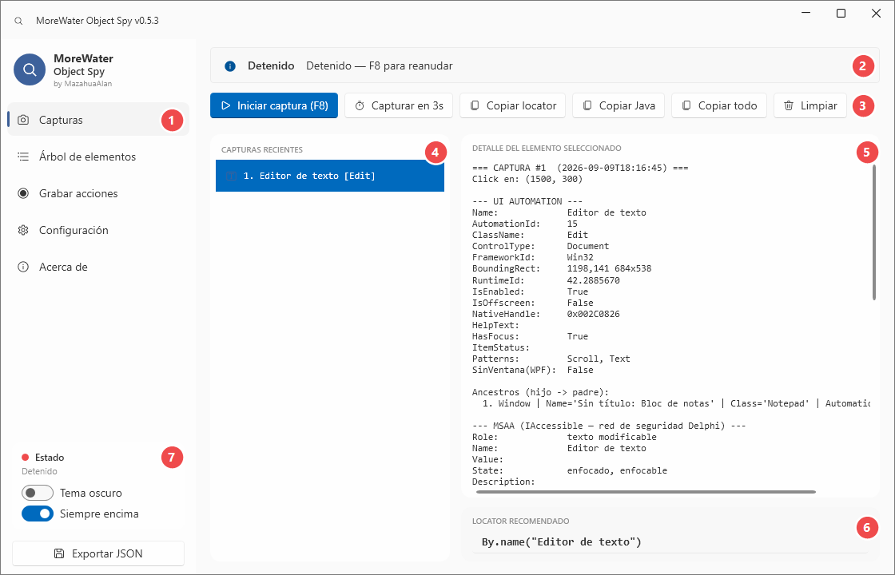
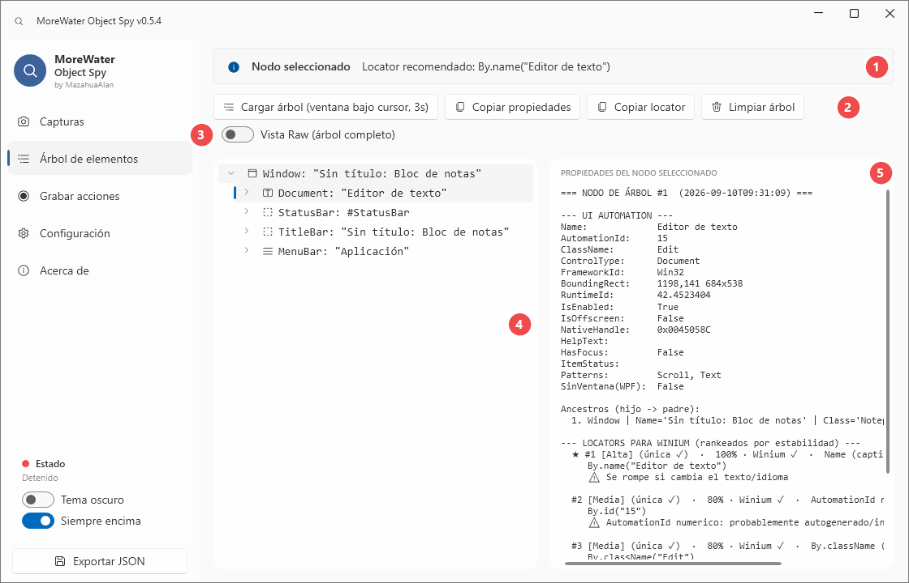
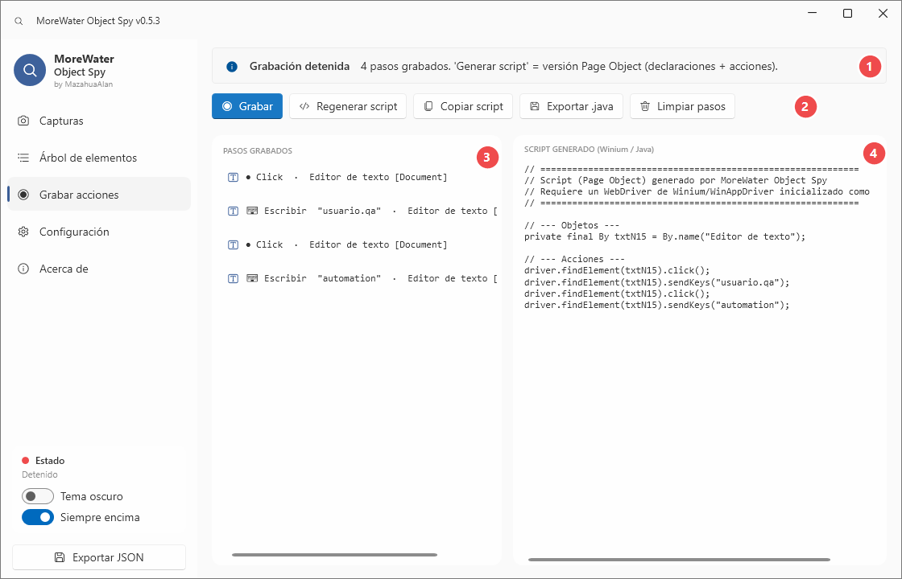
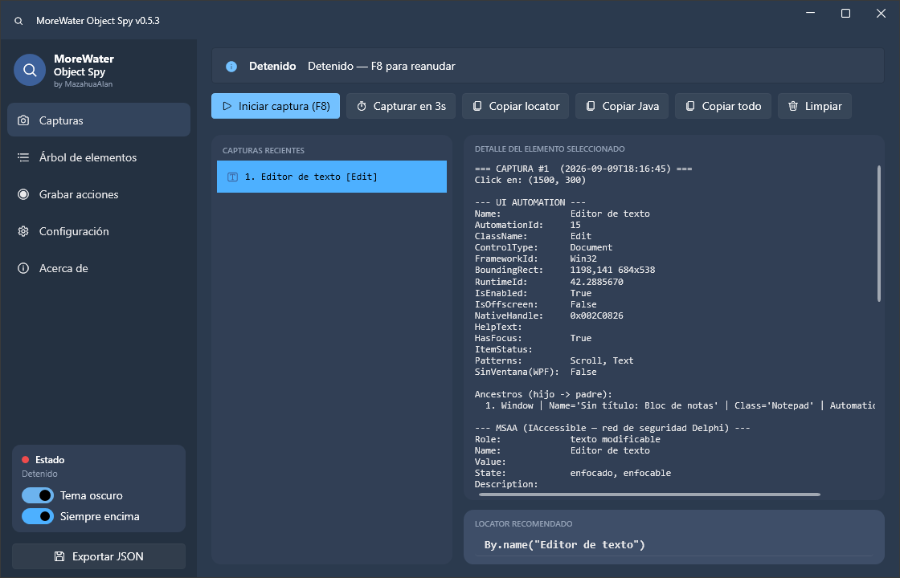
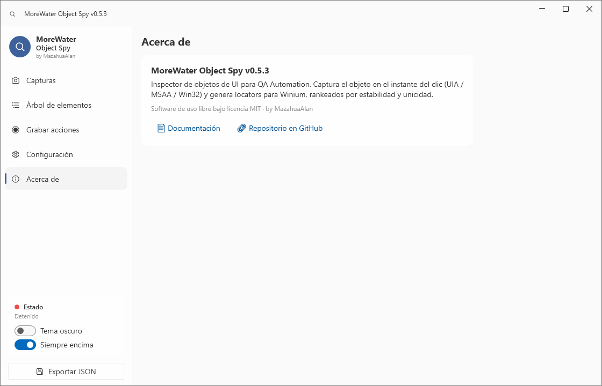

# Guía visual — MoreWater Object Spy

Recorrido por cada parte de la herramienta, con capturas reales. En todas las pantallas de esta guía
la **aplicación objetivo es el Bloc de notas de Windows**, para que los datos que se ven sean reales
y no un panel vacío de ejemplo.

> ¿Vienes de cero? El resumen es: **F8 → clic en el control → copias el locator**. Lo demás son atajos
> para los casos en los que eso no basta.

---

## 1. Vista **Capturas** — el flujo principal

Capturas el objeto en el instante del clic y lees todo lo que la herramienta sabe de él.



| # | Qué es | Para qué sirve |
|---|---|---|
| **1** | **Navegación** | Cambia entre las cinco vistas. La vista activa queda marcada a la izquierda. |
| **2** | **Barra de estado** | Dice si está capturando y qué se espera de ti. Es el primer sitio donde mirar si algo no pasa. |
| **3** | **Acciones** | Iniciar/detener la captura (F8), *Capturar en 3s* (para menús), y copiar el locator, el snippet Java o todo el bloque de propiedades. |
| **4** | **Capturas recientes** | Historial de la sesión. Haz clic en cualquiera para volver a verla: el snapshot es inmutable, sigue ahí aunque la app objetivo se haya cerrado. |
| **5** | **Detalle del elemento** | Propiedades de los tres motores (UI Automation, MSAA, Win32), la cadena de ancestros y los locators rankeados. |
| **6** | **Locator recomendado** | El que la herramienta elige. En el ejemplo, `By.name("Editor de texto")`. |
| **7** | **Estado y apariencia** | Tema oscuro y *Siempre encima* (útil: la spy no se esconde detrás de la app que estás inspeccionando). |

### Los dos modos de captura

| Modo | Cómo | Cuándo usarlo |
|---|---|---|
| **Al clic** | **F8** y luego clic en el control | El caso normal. Sobrevive a que la ventana cambie o se abra un modal. |
| **Sin clic** | **F9** o *Capturar en 3s*, y dejas el cursor encima | Menús desplegables, tooltips y hovers: cualquier cosa que se cierre si haces clic en otro sitio. |

---

## 2. Vista **Árbol de elementos** — cuando no puedes hacer clic

Explora la ventana completa como jerarquía. Sirve para controles ocultos, deshabilitados, fuera de
pantalla o que desaparecen al perder el foco.



| # | Qué es | Para qué sirve |
|---|---|---|
| **1** | **Mensajes de la vista** | Confirma cada acción: árbol cargado, nodo seleccionado con su locator, o qué se copió. |
| **2** | **Acciones** | *Cargar árbol* (cuenta 3s: pon el cursor sobre la ventana a explorar), *Copiar propiedades*, *Copiar locator* y *Limpiar árbol*. |
| **3** | **Vista Raw** | Alterna entre la vista de control (limpia, la que ve Winium) y el árbol completo, con todos los elementos intermedios. Si un control "no aparece", actívala. |
| **4** | **Árbol jerárquico** | Carga perezosa: los hijos se leen al expandir, así que abrir una ventana enorme no congela nada. Cada tipo de control lleva su icono. |
| **5** | **Propiedades del nodo** | Lo mismo que en Capturas, pero del nodo seleccionado. Sin MSAA/Win32: en el árbol solo hay UI Automation. |

> El botón **Cargar árbol** usa la ventana que esté **bajo el cursor cuando termina la cuenta de 3 segundos**,
> no la que estaba al pulsarlo. Pulsa y mueve el ratón a la app objetivo.

---

## 3. Vista **Grabar acciones** — del clic al script

Graba lo que haces y lo convierte en un script de Winium listo para pegar.



| # | Qué es | Para qué sirve |
|---|---|---|
| **1** | **Estado del grabador** | Grabando o detenido, y cuántos pasos llevas. |
| **2** | **Acciones** | Grabar/Detener, *Regenerar script*, *Copiar script*, *Exportar .java* y *Limpiar pasos*. |
| **3** | **Pasos grabados** | Un paso por acción. Fíjate en que la escritura se **agrupa por campo**: los diez caracteres de `usuario.qa` son un solo paso *Escribir*, no diez. **Doble clic en un paso** abre el selector de locators alternativos. |
| **4** | **Script generado** | Estilo Page Object: primero las declaraciones `By`, después las acciones. Se actualiza en vivo mientras grabas. |

El script del ejemplo, tal cual sale:

```java
// --- Objetos ---
private final By txtN15 = By.name("Editor de texto");

// --- Acciones ---
driver.findElement(txtN15).click();
driver.findElement(txtN15).sendKeys("usuario.qa");
```

Si un locator **no es único**, el script cambia solo a la forma indexada, para que apunte al control correcto:

```java
driver.findElements(BTN_GUARDAR).get(2).click();  // objeto #3 de 5
```

---

## 4. Cómo leer un locator

Cada candidato se presenta así (se ve en el panel derecho de la vista Árbol):

```
★ #1 [Alta]  (única ✓)  ·  100%  ·  Winium ✓  ·  Name
     By.name("Editor de texto")
     ⚠ Se rompe si cambia el texto/idioma
```

| Campo | Qué significa |
|---|---|
| `★ #1` | Puesto en el ranking. El de la estrella es el recomendado. |
| `[Alta]` | Estabilidad esperada frente a cambios de la aplicación. |
| `(única ✓)` | La herramienta **contó** las coincidencias en la ventana real. Si hubiera varias diría `(N coincid., #k)` y te daría el índice correcto. |
| `100%` | Confianza combinada de estabilidad y unicidad. |
| `Winium ✓` | Que Winium **soporta de verdad** esa estrategia. Las propiedades de MSAA y Win32 salen como diagnóstico, no como locator. |
| `⚠` | El riesgo concreto de ese locator. Léelo: es la diferencia entre un test estable y uno que falla el martes. |

**Regla práctica:** prefiere siempre un locator con `Winium ✓` y `única ✓`. Si el único disponible depende
del texto visible, asume que se romperá cuando cambie el idioma o la etiqueta.

---

## 5. Apariencia

Tema claro (Fluent, Windows 11) y tema oscuro con la paleta Docks. Se cambia desde la barra lateral o
desde *Configuración*.



---

## 6. Configuración y Acerca de

*Configuración* solo tiene, por ahora, el interruptor de tema — el mismo de la barra lateral. *Acerca de* lleva la
versión instalada y los enlaces a la documentación y al repositorio.



> La versión que aparece en la barra de título y en esta pantalla es la que debes citar al reportar un problema.

---

## 7. Recetas rápidas

| Situación | Qué hacer |
|---|---|
| El menú se cierra al hacer clic | **F9** o *Capturar en 3s*, con el cursor sobre la opción. |
| El control no aparece en el árbol | Activa **Vista Raw**. |
| Hiciste clic en el texto de un botón | No hace falta repetirlo: la herramienta **promociona** al control accionable (el botón) sola. |
| Hay cinco controles iguales | Usa el locator indexado que ya te da; el número entre paréntesis es cuál de los cinco es. |
| Es una app Delphi/VCL sin AutomationId | Mira la sección **MSAA** para entender el control, pero construye el locator con lo que marque `Winium ✓`. |
| La app objetivo corre como administrador | Ejecuta también la spy como administrador, o no verá sus ventanas. |

---

<p align="center">
  MIT © <strong>MazahuaAlan</strong> · <a href="https://mazahuaalan.github.io/MoreWaterObjectSpy-docs/">Sitio de documentación</a>
</p>
